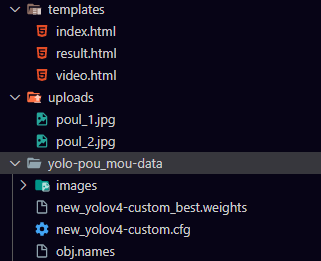

# ***SIF1033 Projet de session : DETECTION DE POULET EN UTILISANT YOLO ET CNN***

Le projet se trouve ici :`https://github.com/JohnRosey/Flask.git`

**Comment le lancer?**

---

Faire ` pip install -r requirements.txt` si il y'a une erreur editer le fichier requirements.txt et commenter ou decommenter `opencv-contrib-python-3.4.14.51`

* [X] Veuillez installer python 3.6-3.9.

Le programme se lance avec `python app.py`  et ensuite `http://127.0.0.1:8080`

Il s'agit d'une application **Flask** , si sa ne fonctionne pas changez de branche vers `test-linux` il y'a un fichier `tkgui.py` qui est l'interface

ll peut avoir un probleme de path **c'est a dire : \ ou / dans les fichiers**

* [ ] **N'oubliez pas de configurer le  git-LFS** car le dossier `yolo-pou_mou-data` contient les poids en `*.weights` environ 250 mb

# Fonctionnement

# Les classes et documents 

### `centroidtracker.py`:

---

 permet de suivre les objets dans une séquence d'images. Il utilise la distance entre les centroïdes des objets pour déterminer si un objet doit être suivi, enregistré ou supprimé.

La classe `CentroidTracker` contient les méthodes suivantes :

* `__init__(self, maxDisappeared=50)`: Initialise le suivi des objets avec un identifiant unique, deux dictionnaires ordonnés pour stocker les centroïdes et le nombre de trames consécutives où un objet a disparu, ainsi qu'un seuil de trames consécutives pour supprimer un objet du suivi.
* `register(self, centroid)`: Enregistre un nouvel objet en utilisant l'identifiant unique disponible et stocke le centroïde de l'objet.
* `deregister(self, objectID)`: Supprime un objet du suivi en supprimant son identifiant et ses informations associées des dictionnaires.
* `update(self, rects)`: Met à jour le suivi des objets en fonction des rectangles englobants fournis en entrée. Cette méthode effectue les actions suivantes :
  * Si aucune boîte englobante n'est fournie, tous les objets suivis sont marqués comme disparus et éventuellement supprimés.
  * Les centroïdes d'entrée sont calculés à partir des coordonnées des rectangles englobants.
  * Si aucun objet n'est suivi actuellement, tous les centroïdes d'entrée sont enregistrés.
  * Sinon, les centroïdes d'entrée sont comparés aux centroïdes des objets suivis pour déterminer s'ils doivent être mis à jour, enregistrés ou supprimés.

La classe utilise la bibliothèque `scipy.spatial` pour calculer les distances entre les paires de centroïdes, ainsi que `numpy` pour la manipulation des tableaux et `collections.OrderedDict` pour stocker les objets et les informations associées de manière ordonnée.

En résumé, cette classe permet de suivre plusieurs objets dans une séquence d'images en se basant sur la distance entre leurs centroïdes. Elle enregistre, met à jour et supprime les objets en fonction de leur présence dans les trames consécutives.

### `YoloCam.py`

---

pour suivre les objets détectés dans une séquence vidéo en temps réel. Le code fait les choses suivantes :

1. Charge les étiquettes des objets (labels) à partir d'un fichier texte.
2. Charge le réseau YOLOv4 à partir des fichiers de configuration et de poids.
3. Traite chaque image de la séquence vidéo pour détecter les objets et obtenir les boîtes englobantes.
4. Dessine les boîtes englobantes et les étiquettes sur les objets détectés dans chaque image.
5. Utilise la classe `CentroidTracker` pour suivre les objets détectés en se basant sur les boîtes englobantes.
6. Affiche le nombre d'objets détectés à l'écran.

Les fonctions définies dans le code sont les suivantes :

* `read_labels(file_path)`: Lit les étiquettes des objets à partir d'un fichier texte et les retourne sous forme de liste.
* `load_network(config_path, weights_path)`: Charge le réseau YOLOv4 et retourne le réseau et les noms des couches de sortie.
* `process_frame(frame, network, layers_names_output, probability_minimum, threshold)`: Traite une image pour détecter les objets et retourne les résultats, les boîtes englobantes, les niveaux de confiance et les numéros de classe.
* `draw_boxes_and_labels(frame, results, bounding_boxes, confidences, class_numbers, labels, colours)`: Dessine les boîtes englobantes et les étiquettes sur les objets détectés et retourne l'image modifiée et les rectangles englobants.

La fonction `main` fait les choses suivantes :

1. Ouvre un flux vidéo à partir de la caméra.
2. Initialise un objet `CentroidTracker`.
3. Charge les étiquettes, le réseau et les paramètres requis pour la détection d'objets.
4. Traite chaque image de la séquence vidéo et dessine les boîtes englobantes et les étiquettes sur les objets détectés.
5. Utilise la classe `CentroidTracker` pour suivre les objets détectés.
6. Affiche le nombre d'objets détectés à l'écran.
7. Affiche l'image modifiée avec les objets détectés et suivis.

Lorsque l'utilisateur appuie sur la touche "q", le programme se termine et libère les ressources utilisées.

### `new_yolov4-custom_best.weights`, `new_yolov4-custom.cfg` et `obj.names`

---

1. `new_yolov4-custom_best.weights` : Il s'agit du fichier contenant les poids du modèle YOLOv4 personnalisé. Les poids sont les paramètres appris par le modèle lors de son entraînement sur un ensemble de données. Ces poids sont utilisés pour effectuer la détection d'objets sur de nouvelles images.
2. `new_yolov4-custom.cfg` : C'est le fichier de configuration du modèle YOLOv4 personnalisé. Il contient des informations sur l'architecture du modèle, les hyperparamètres et d'autres paramètres liés à l'entraînement et à l'utilisation du modèle. Ce fichier est utilisé pour charger le modèle dans le code.
3. `obj.names` : Il s'agit d'un fichier texte contenant les étiquettes (labels) des objets que le modèle peut détecter. Chaque ligne du fichier représente une étiquette différente. Dans le cas de ce code, les étiquettes sont utilisées pour annoter les objets détectés avec leur nom et leur niveau de confiance sur les images traitées.

Dossier images : Contient les images destinee pour la detection

result_numero_aleatoire : au niveua de la racine du projet les images uploader qui ont subit le traitement

# Differences entre Yolo et cnn:

la différence entre YOLO et CNN réside dans leur utilisation et leur objectif. Les CNN sont un type général de réseau de neurones utilisé pour traiter des images et extraire des caractéristiques, tandis que YOLO est un algorithme spécifique de détection d'objets qui utilise un CNN pour effectuer des prédictions rapides et précises des boîtes englobantes et des classes d'objets en une seule passe à travers le réseau.
